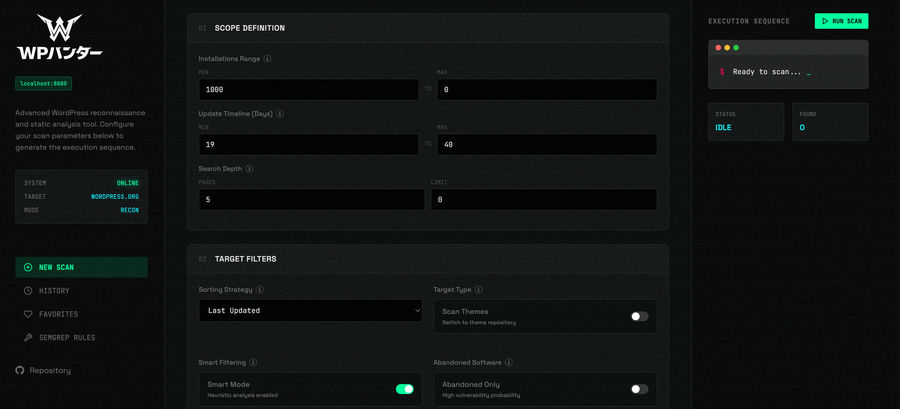
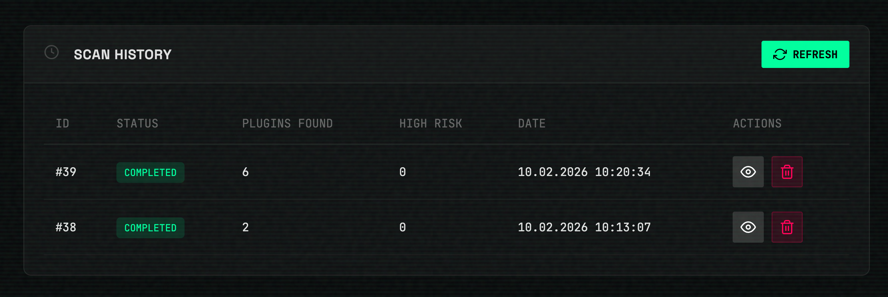
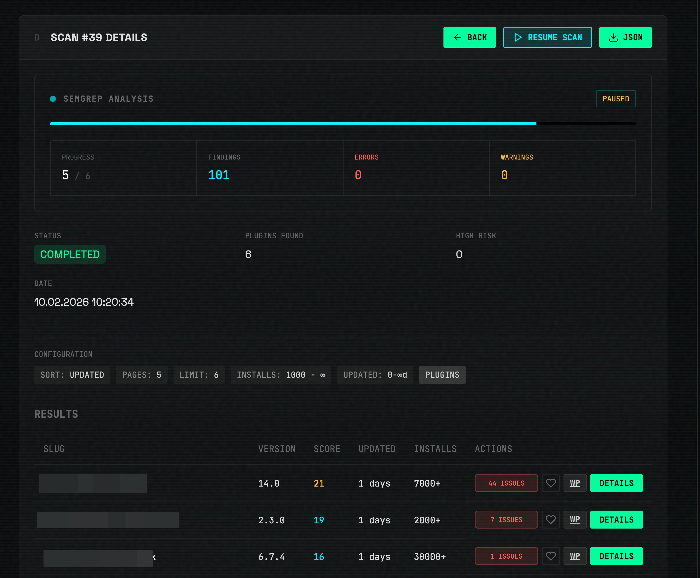
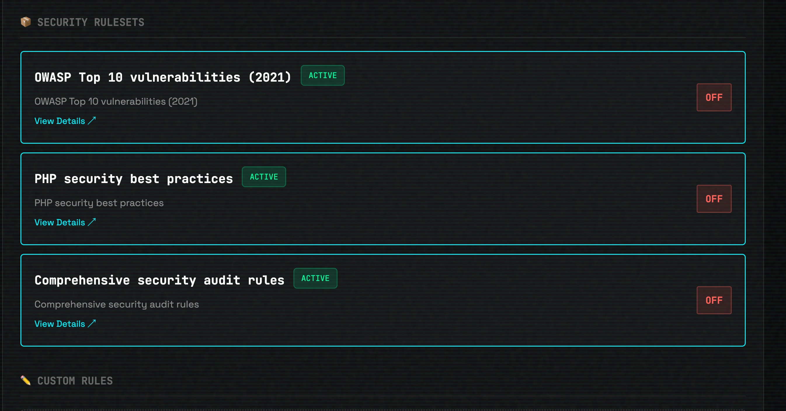
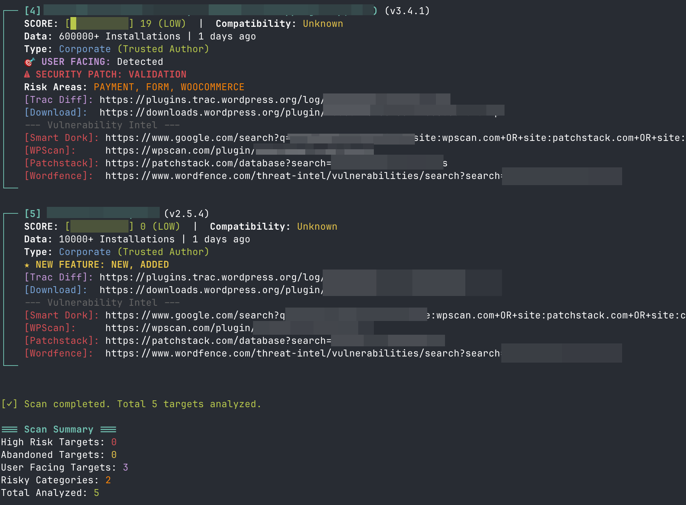

<div align="center">
  
</div>

<p align="center">
  
  
  
</p>

<p align="center">
  <b>🌐 Sprachen:</b><br>
  <a href="README.md"></a>
  <a href="README.tr.md"></a>
  <a href="README.zh.md"></a>
  <a href="README.ar.md"></a>
  <a href="README.de.md"></a>
</p>

WP-Hunter ist ein **WordPress-Plugin/Theme-Aufklärungs- und statisches Analyse-Tool (SAST)**. Es wurde für **Sicherheitsforscher** entwickelt, um die **Wahrscheinlichkeit von Sicherheitslücken** in Plugins zu bewerten, indem Metadaten, Installationsmuster und Update-Verläufe analysiert und eine tiefe **Semgrep-gestützte Quellcode-Analyse** durchgeführt werden.

## 🚀 Hauptmerkmale

*   **Echtzeit-Web-Dashboard**: Eine moderne, auf FastAPI basierende Schnittstelle für visuelles Scannen und Analysieren.
*   **Tiefe SAST-Integration**: Integrierter **Semgrep**-Scan mit Unterstützung für benutzerdefinierte Regeln.
*   **Offline-Aufklärung**: Synchronisieren Sie den gesamten WordPress-Plugin-Katalog mit einer lokalen SQLite-Datenbank für sofortige Abfragen.
*   **Risikobewertung (VPS)**: Heuristikbasierte Bewertung zur Identifizierung von "leicht erreichbaren Zielen" (low hanging fruit) im WordPress-Ökosystem.
*   **Theme-Analyse**: Unterstützung für das Scannen des WordPress-Theme-Repositorys.
*   **Sicherheitsgehärtet**: Eingebauter SSRF-Schutz und sichere Ausführungsmuster.

---

## 🖥️ Modernes Web-Dashboard

WP-Hunter verfügt jetzt über ein leistungsstarkes lokales Dashboard für visuelle Forscher.

### Dashboard-Galerie

<table>
  <tr>
    <td width="50%">
      <b>Hauptoberfläche</b><br>
      Konfigurieren Sie Scan-Parameter mit intuitiven Steuerelementen
    </td>
    <td width="50%">
      <b>Scan-Verlauf</b><br>
      Verfolgen und verwalten Sie alle Ihre früheren Scans
    </td>
  </tr>
  <tr>
    <td>
      
    </td>
    <td>
      
    </td>
  </tr>
  <tr>
    <td width="50%">
      <b>Scan-Details mit Semgrep</b><br>
      Tiefe SAST-Analyse mit Problemverfolgung
    </td>
    <td width="50%">
      <b>Sicherheitsregelsätze</b><br>
      Verwalten Sie OWASP- und benutzerdefinierte Semgrep-Regeln
    </td>
  </tr>
  <tr>
    <td>
      
    </td>
    <td>
      
    </td>
  </tr>
  <tr>
    <td colspan="2" align="center">
      <b>CLI-Ausgabe</b><br>
      Umfangreiche Terminaloberfläche mit Informationen zu Schwachstellen
    </td>
  </tr>
  <tr>
    <td colspan="2">
      
    </td>
  </tr>
</table>

### Dashboard-Funktionen:
*   **Echtzeit-Ausführungssequenz**: Sehen Sie sich Scan-Ergebnisse live über WebSockets an.
*   **Integriertes Semgrep**: Führen Sie mit einem Klick eine tiefe statische Analyse für bestimmte Plugins durch.
*   **Scan-Verlauf**: Speichern und vergleichen Sie frühere Scan-Sitzungen.
*   **Favoriten-System**: Verfolgen Sie "interessante" Ziele für eine weitere manuelle Überprüfung.
*   **Benutzerdefinierte Regeln**: Fügen Sie Ihre eigenen Semgrep-Sicherheitsregeln direkt über die Benutzeroberfläche hinzu und verwalten Sie sie.

---

## 📦 Installation

### Voraussetzungen
- Python 3.8 oder höher
- pip (Python-Paketinstallationsprogramm)
- [Semgrep](https://semgrep.dev/docs/getting-started/) (Optional, für tiefgehende Analyse)

### Einrichtung
1. Repository klonen:
```bash
git clone https://github.com/xelox/WP-Hunter.git
cd WP-Hunter
```
2. Virtuelle Umgebung erstellen und aktivieren:
```bash
python3 -m venv venv
source venv/bin/activate  # Unter Windows: venv\Scripts\activate
```
3. Abhängigkeiten installieren:
```bash
pip install -r requirements.txt
```

---

## 🛠️ Verwendung

### 1. Starten des Web-Dashboards (Empfohlen)
```bash
python3 wp-hunter.py --gui
```
Greifen Sie unter `http://localhost:8080` auf die Schnittstelle zu.

### 2. Datenbank-Synchronisierung (Für Offline-Aufklärung)
Füllen Sie Ihre lokale Datenbank mit Plugin-Metadaten für sofortiges Filtern:
```bash
# Synchronisieren der Top 100 Seiten von Plugins
python3 wp-hunter.py --sync-db --sync-pages 100

# Synchronisieren des gesamten WordPress-Katalogs (~60k Plugins)
python3 wp-hunter.py --sync-all
```

### 3. Abfragen der lokalen Datenbank
Fragen Sie Ihre lokale Datenbank ab, ohne die WordPress-API zu nutzen:
```bash
# Plugins mit 10k+ Installationen finden, die seit 2 Jahren nicht aktualisiert wurden
python3 wp-hunter.py --query-db --min 10000 --abandoned

# Suche nach "form"-Plugins mit niedrigen Bewertungen
python3 wp-hunter.py --query-db --search "form" --sort-by rating --sort-order asc
```

### 4. CLI-Scannen (Klassischer Modus)
```bash
# Scannen von 10 Seiten aktualisierter Plugins mit aktivierter Semgrep-Analyse
python3 wp-hunter.py --pages 10 --semgrep-scan --limit 20
```

---

## 🎯 Hunter-Strategien

### 1. Die "Zombie"-Jagd (Hohe Erfolgsquote)
Zielen Sie auf Plugins ab, die weit verbreitet sind, aber aufgegeben wurden.
*   **Logik:** Veralteter Code entspricht oft nicht modernen Sicherheitsstandards (fehlende Nonces, schwache Bereinigung).
*   **Befehl:** `python3 wp-hunter.py --abandoned --min 1000 --sort popular`

### 2. Der "Aggressive" Modus
Für Hochgeschwindigkeits-Aufklärung mit hoher Parallelität über große Bereiche hinweg.
*   **Befehl:** `python3 wp-hunter.py --aggressive --pages 200`

### 3. Die "Komplexitäts"-Falle
Zielen Sie auf komplexe Funktionen (Datei-Uploads, Zahlungen) in mittelgroßen Plugins ab.
*   **Befehl:** `python3 wp-hunter.py --smart --min 500 --max 10000`

---

## 📊 VPS-Logik (Wahrscheinlichkeitsscore für Schwachstellen)

Der Score (0-100) spiegelt die Wahrscheinlichkeit von **ungepatchten** oder **unbekannten** Schwachstellen wider:

| Metrik | Bedingung | Auswirkung | Begründung |
|--------|-----------|------------|------------|
| **Code-Fäule** | > 2 Jahre alt | **+40 Pkt** | Aufgegebener Code ist ein kritisches Risiko. |
| **Angriffsfläche** | Riskante Tags | **+30 Pkt** | Zahlung, Upload, SQL, Formulare haben eine hohe Komplexität. |
| **Vernachlässigung** | Support < 20% | **+15 Pkt** | Entwickler, die Benutzer ignorieren, ignorieren wahrscheinlich auch Sicherheitsberichte. |
| **Code-Analyse** | Gefährliche Funk. | **+5-25 Pkt** | Vorhandensein von `eval()`, `exec()` oder ungeschütztem AJAX. |
| **Technische Schulden** | Veraltetes WP | **+15 Pkt** | Nicht mit dem neuesten WordPress-Core getestet. |
| **Wartung** | Update < 14T | **-5 Pkt** | Aktive Entwickler sind ein positives Signal. |

---

## ⚖️ Rechtlicher Hinweis

Dieses Tool ist nur für **Sicherheitsforschung und autorisierte Aufklärung** bestimmt. Es soll Sicherheitsexperten und Entwicklern helfen, Angriffsflächen zu bewerten und die Gesundheit von Plugins zu analysieren. Die Autoren sind nicht für Missbrauch verantwortlich. Stellen Sie immer sicher, dass Sie über die entsprechende Autorisierung verfügen, bevor Sie sicherheitsrelevante Aktivitäten durchführen.
