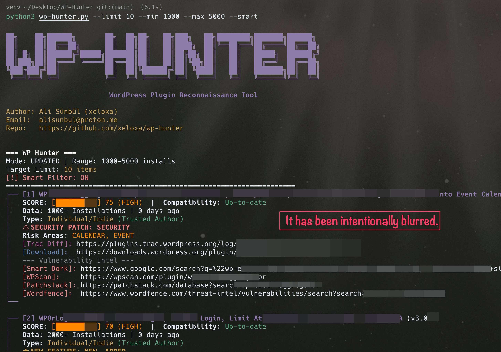
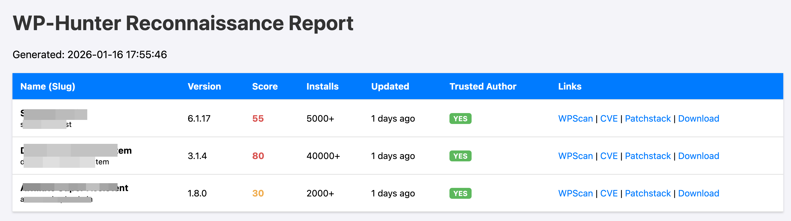

<div align="center">
  
</div>

<p align="center">
  
  
  
</p>

WP-Hunter is a **WordPress plugin/theme reconnaissance and static analysis (SAST) tool**. It is designed for **security exploration** and evaluates the **probability** of potential vulnerabilities or outdated plugins by analyzing metadata, installation patterns, update histories, and **source code** from the WordPress repository.

> [!IMPORTANT]
> This is an **exploration tool**. It does not guarantee the existence of a vulnerability; instead, it provides a "Vulnerability Probability Score" (VPS) based on heuristics to help researchers prioritize their findings.

## Demo

<div align="center">
  
</div>

*WP-Hunter tool in action, showing plugin reconnaissance and probability scoring*

<div align="center">
  
</div>

*Deep analysis showing security risk scoring, dangerous functions, and vulnerability intelligence*

## Report Example

<div align="center">
  
</div>

*Generated HTML report showing vulnerability risks*

## Core Concept: "Neglect & Surface" Model

WP-Hunter follows a professional risk assessment model focusing on **Abandonment** and **Complexity**:
- **Code Rot (Highest Risk)**: Plugins not updated for years are the breeding ground for vulnerabilities.
- **Attack Surface**: Plugins that handle payments, uploads, or user input naturally have more room for error.
- **Developer Neglect**: Low support resolution rates indicate a developer who may ignore security reports.
- **No Penalty for Security Fixes**: Unlike basic scanners, we do not penalize developers for patching bugs. A recent security update is a sign of *good* hygiene.

## Installation

### Prerequisites
- Python 3.6 or higher
- pip (Python package installer)

### Setup
1. Clone or download the repository
2. Create and activate virtual environment:
```bash
python3 -m venv venv
source venv/bin/activate  # On Windows: venv\Scripts\activate
```
3. Install required dependencies:
```bash
pip install requests
```

## Usage

Run the tool to start the exploration:
```bash
python3 wp-hunter.py
```

### Command Line Options

- `--pages`: Maximum number of pages to scan (default: 5). *See "Understanding Page Logic" below.*
- `--limit`: Maximum number of targets to list (0 = Unlimited, default: 0)
- `--min`: Minimum active installations (default: 1000)
- `--max`: Maximum active installations (0 = Unlimited, default: 0)
- `--sort`: Sort method (choices: new, updated, popular, default: updated)
- `--smart`: Show only plugins in risky categories
- `--abandoned`: Show only plugins that haven't been updated in over 2 years
- `--min-days`: Minimum days since last update (e.g., find plugins updated > 3 days ago)
- `--max-days`: Maximum days since last update (e.g., find plugins updated < 10 days ago)
- `--output`: Save results to a file (e.g., `results.json`)
- `--format`: Output format (choices: `json`, `csv`, `html`, default: `json`)
- `--download N`: Automatically download top N plugins (sorted by VPS score) to `./Plugins/`

### New: Static Analysis & Advanced Options
- `--themes`: Scan WordPress themes instead of plugins
- `--deep-analysis`: Enable static code analysis (SAST) to find dangerous functions and security flaws (Downloads plugins)
- `--ajax-scan`: Focus on plugins/themes with AJAX endpoints
- `--dangerous-functions`: Scan for dangerous PHP functions like `eval()`, `exec()`, etc.
- `--user-facing`: Focus on plugins that interact directly with end-users (forms, chat, galleries, etc. - high risk)
- `--auto-download-risky N`: Automatically download and analyze the top N riskiest targets

### Understanding Page Logic (`--pages`)

The tool fetches data in "pages" from the WordPress API, where **1 page = 100 plugins**.
- **Default (5 pages)**: Scans the most recent 500 plugins.
- **Auto-Expansion**: If you filter by date (e.g., `--min-days 30`), the tool automatically increases the page limit (e.g., to 50 or 100 pages) to ensure it digs deep enough to find matching plugins.
- **Manual Control**: You can always override this with `--pages 50` (scans 5000 plugins) for deeper reconnaissance.

### Example Commands

**1. Find Specific Update Windows (NEW)**
Find plugins updated between 3 and 10 days ago:
```bash
python3 wp-hunter.py --min-days 3 --max-days 10
```

**2. Find Recently Updated Plugins**
Find plugins updated in the last 5 days:
```bash
python3 wp-hunter.py --max-days 5
```

**3. Focus on High-Risk Categories**
Search for e-commerce, forms, or upload plugins with specific install counts:
```bash
python3 wp-hunter.py --limit 10 --min 1000 --max 5000 --smart
```

**4. Find "Zombie" Plugins**
Find plugins abandoned for more than 2 years and save the report:
```bash
python3 wp-hunter.py --abandoned --limit 50 --output zombie_plugins.json
```

**5. Auto-Download High-Risk Plugins**
Download the top 5 highest-scoring plugins for manual code review:
```bash
python3 wp-hunter.py --smart --download 5
```

**6. Deep Code Analysis (SAST)**
Download and analyze plugins for dangerous functions and insecure AJAX endpoints:
```bash
python3 wp-hunter.py --deep-analysis --limit 10
```

**7. Theme Security Scanning**
Scan popular themes for security risks:
```bash
python3 wp-hunter.py --themes --pages 2
```

**8. User-Facing Plugin Hunt**
Focus on plugins that interact directly with users (higher risk of XSS/Injection):
```bash
python3 wp-hunter.py --user-facing --auto-download-risky 5
```

## 🎯 Hunter Strategies (Tips for Researchers)

If you are looking for CVEs or bug bounties, try these specific workflows:

### 1. The "Zombie" Hunt (High Success Rate)
Target plugins that are widely used but abandoned.
*   **Logic:** Legacy code often lacks modern security standards (e.g., missing nonces, weak sanitization) that are standard today.
*   **Command:** `python3 wp-hunter.py --abandoned --min 1000 --sort popular`

### 2. The "Fresh Code" Vector
Target popular plugins that pushed code in the last 48 hours.
*   **Logic:** New features = New attack surfaces. Bugs are most likely to exist in code written yesterday.
*   **Command:** `python3 wp-hunter.py --max-days 2 --min 10000 --sort updated`

### 3. The "Complexity" Trap
Target complex functionality (File Uploads, Payments) in mid-range plugins.
*   **Logic:** Handling files and money is difficult. Indie developers often make mistakes in logic flows here.
*   **Command:** `python3 wp-hunter.py --smart --min 500 --max 10000`

## Professional VPS Logic (Vulnerability Probability Score)

The score (0-100) is calculated based on the likelihood of **unpatched** or **unknown** (0-day) vulnerabilities:

| Metric | Condition | Impact | Reasoning |
|--------|-----------|--------|-----------|
| **Code Rot** | > 2 Years Old | **+40 pts** | Abandoned code is critical risk. Libraries expire, WP API changes. |
| **Code Rot** | > 1 Year Old | **+25 pts** | Highly neglected. |
| **Attack Surface** | Risky Tags | **+30 pts** | Payment, Upload, SQL, Forms have inherently higher complexity/risk. |
| **Neglect** | Support < 20% | **+15 pts** | If dev ignores users, they likely ignore security reports. |
| **Code Analysis** | Dangerous Funcs / Unprotected AJAX | **+5 to +25 pts** | Presence of eval/exec or AJAX without nonces increases risk significantly. |
| **User Facing** | User Interaction | **+5 pts** | Direct user interaction (chat, forms) increases XSS/Injection risk. |
| **Tech Debt** | Outdated WP | **+15 pts** | Not tested with latest core version. |
| **Reputation** | Rating < 3.5 | **+10 pts** | Signal of poor user experience/code quality. |
| **Maintenance** | Update < 14 days | **-5 pts** | **Reward:** Active developer is present and watching. |

*Note: The presence of "Security Fixes" in changelogs is flagged visually for N-day analysis but does **NOT** increase the VPS score. We reward patching, not punish it.*

## Risk Categories

The tool identifies plugins in sensitive functional areas where vulnerabilities often carry higher impact:
- E-commerce and Payment Gateways
- Form Builders and Input Systems (User Facing)
- Media Uploaders and Managers
- Authentication and User Management
- Database and API Connectors
- Interactive User Features (Chat, Comments, Reviews)

## Score Interpretation

- **CRITICAL (80-100)**: **Abandoned & Complex.** High chance of structural vulnerabilities.
- **HIGH (50-79)**: **Neglected.** Likely contains outdated code or unresolved issues.
- **LOW (0-49)**: **Maintained.** Routine risk, generally safe unless a specific 0-day exists.

## Legal Disclaimer

This tool is designed for **security research and authorized reconnaissance** purposes only. It is intended to assist security professionals and developers in assessing attack surfaces and evaluating plugin health. The authors are not responsible for any misuse. Always ensure you have appropriate authorization before performing any security-related activities.
